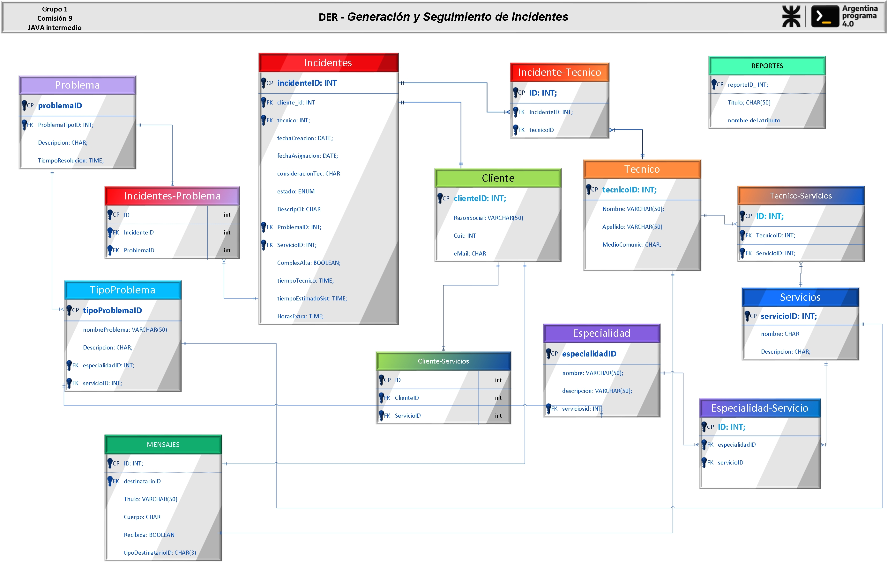

  

# summary
# <h1 align="center" >__Trabajo Práctico Integrador - 2da. Parte v2.0__</h1>

  

__CONSIGNA__: Codificación 
 de las anotaciones JPA a las clases implementadas en la parte 1
para su persististencia en una Base de Datos Relacional. 

  
  

## <h2 align="center" >__Datos de la Presentación__</h2>

#### Fecha Segunda Entrega: ` 30 de noviembre del 2023  `
>##### Integrantes por orden alfabético:
>* __`Kadyr Valdes`__
>* __`Pablo Gaboardi`__
>* __`Quimey Pulido`__
>* __`Arian Savall`__
>* __`Guillermo Escobar`__
>* __`Victor Gimenez`__
 
   

# Contenido

- [Sumario](#summary)
- [UML](#uml)
- [DER](#der)
 

  __JAVA MAVEN Project__
  Dependencias: 
>* __Lombok__
>* __mysql-connector-java__
>* __jdbc-mysql-plugin__
>* __mysql-jdbc__
>* __hibernate-core__
>* __javax / javaee-api (Dependencia para Java EE: incluye JPA)__

 Plug-in:
>* __maven-shade-plugin__

 Estructura - capas:
>* __config__
>* __controllers__
>* __DAO__
>* __models__
>* __services__

# <h1 align="center" >**Diagrama de Clases** </h1>
# uml

  

  

# der
# <h1 align="center" >__Diagrama de Entidad Relación__ </h1>

  

